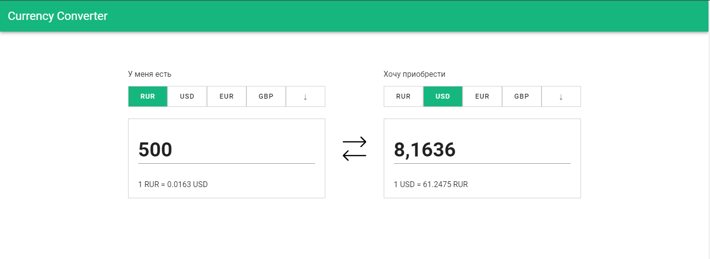
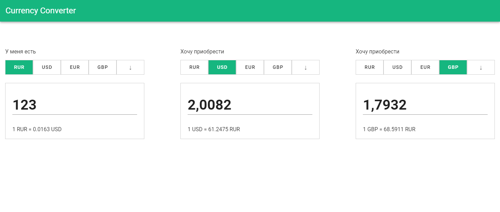

# Конвертер валют 

Проект доступен на GitHub Pages: https://oyshen12.github.io/CurrencyConverter/

Суть проекта заключается в создании переиспользуемого компонента конвертера валют. С помощью пропсов мы указываем с какими валютами будет связан текущий конвертер и таким образом можно создавать и комбинировать сколь угодно много конвертеров(на 2 фотографии пример с 3 конверерами).

### Текущее приложение:


### Приложение с 3 конвертерами:


## Project setup
```
npm install
```

### Compiles and hot-reloads for development
```
npm run serve
```

### Compiles and minifies for production
```
npm run build
```

### Customize configuration
See [Configuration Reference](https://cli.vuejs.org/config/).
